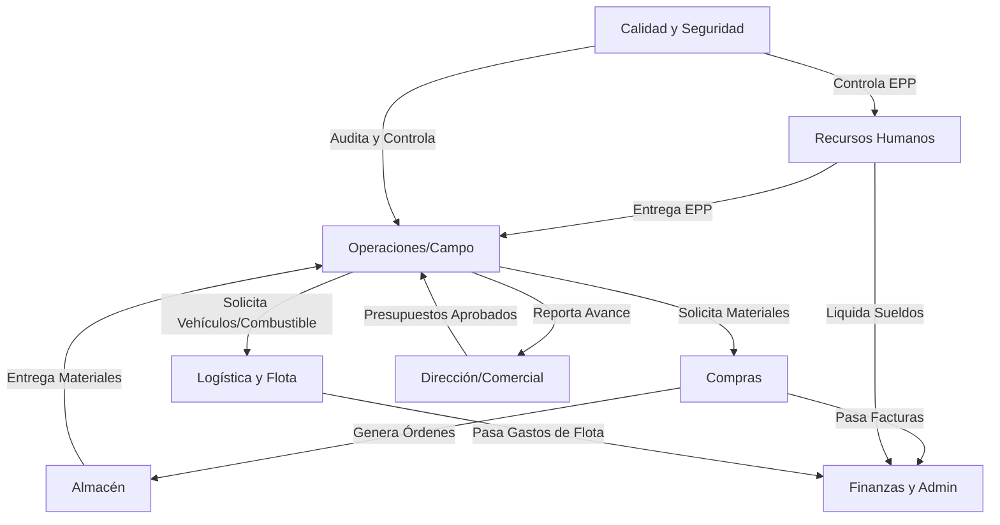

# Reporte de Roles y Necesidades de Personal - Sistema Ecar

## 1. Resumen Ejecutivo
Para implementar y operar correctamente el Sistema Ecar en su totalidad, gestionando todos los puntos de entrada de datos (Data Entry), se estima un equipo administrativo/gestión mínimo de **8 a 9 personas**. 

A continuación se detalla el recuento de personal por área:
1. **Recursos Humanos:** 1 persona
2. **Finanzas y Administración:** 1 a 2 personas
3. **Compras e Inventario:** 2 personas (1 Compras, 1 Almacén)
4. **Operaciones / Proyectos:** 1 a 2 personas (Jefatura de Obra / Oficina Técnica)
5. **Logística y Flota:** 1 persona
6. **Calidad y Seguridad (HSEQ):** 1 persona
7. **Dirección / Comercial:** 1 persona

---

## 2. Detalle por Rol

### 2.1. Analista de Recursos Humanos
- **Cantidad de Personas:** 1
- **Responsabilidades (Data Entry):**
  - Alta, baja y modificación de perfiles de empleados.
  - Registro de asistencia diaria y control de presentismo.
  - Carga de novedades de nómina (horas extra, ausencias, licencias).
  - Liquidación de sueldos y generación de recibos PDF.
  - Entrega de Elementos de Protección Personal (EPP).
- **Capacitación:** Manejo de nómina, leyes laborales vigentes, uso de módulos de RRHH del sistema.
- **Requisitos Tecnológicos:** PC de escritorio estándar o Laptop, conexión a internet estable.

### 2.2. Analista / Gerente de Finanzas
- **Cantidad de Personas:** 1 a 2 (dependiendo del volumen de transacciones)
- **Responsabilidades (Data Entry):**
  - Carga y registro de facturas de proveedores.
  - Emisión y registro de pagos, cobros y cheques.
  - Carga de presupuestos generales de proyectos.
  - Control de liquidez y seguimiento de caja mensual.
- **Capacitación:** Conocimientos contables y financieros, control de flujo de caja y presupuestación.
- **Requisitos Tecnológicos:** PC con buena capacidad de procesamiento (recomendado doble monitor para contrastar facturas y sistema), conexión a internet.

### 2.3. Encargado de Compras
- **Cantidad de Personas:** 1
- **Responsabilidades (Data Entry):**
  - Alta y evaluación de proveedores.
  - Recepción de Solicitudes de Compra y generación de Órdenes de Compra (OC).
  - Seguimiento de entregas.
- **Capacitación:** Gestión de cadena de suministro, negociación, administración de contratos.
- **Requisitos Tecnológicos:** PC de escritorio estándar.

### 2.4. Jefe de Almacén e Inventario
- **Cantidad de Personas:** 1
- **Responsabilidades (Data Entry):**
  - Recepción de materiales y actualización de stock físico (entradas).
  - Control de despachos y entregas a campo (salidas).
  - Mapeo y organización física del almacén en el sistema.
- **Capacitación:** Gestión de inventarios, logística de almacenes, uso de lectores de códigos de barras.
- **Requisitos Tecnológicos:** PC de escritorio en almacén, Lector de Códigos de Barras, Tablet o dispositivo móvil robusto para escaneo en movimiento.

### 2.5. Coordinador de Logística y Flota
- **Cantidad de Personas:** 1
- **Responsabilidades (Data Entry):**
  - Registro de vehículos (Vehicles Registry) y conductores (Drivers Registry).
  - Carga de consumos y solicitudes de combustible.
  - Registro de mantenimientos, cambio de neumáticos y check-in/check-out de vehículos.
- **Capacitación:** Gestión de flotas vehiculares, mantenimiento preventivo y logística.
- **Requisitos Tecnológicos:** PC estándar, Smartphone o Tablet para realizar check-in/out vehicular en el patio.

### 2.6. Jefe de Obra / Operaciones
- **Cantidad de Personas:** 1 a 2 por proyecto activo
- **Responsabilidades (Data Entry):**
  - Carga de reportes diarios de obra (Daily Reports).
  - Actualización de avance de tareas (WBS / Field Module).
  - Emisión de solicitudes de materiales y equipos.
- **Capacitación:** Gestión de proyectos (PMI/Ágil), metodologías constructivas, uso de herramientas móviles de reporte.
- **Requisitos Tecnológicos:** Smartphone de gama media/alta o Tablet con plan de datos móviles para uso en campo, Laptop para oficina técnica.

### 2.7. Responsable de Calidad y Seguridad (HSEQ)
- **Cantidad de Personas:** 1
- **Responsabilidades (Data Entry):**
  - Carga y actualización de manuales y procedimientos.
  - Registro de No Conformidades e inspecciones de seguridad.
  - Seguimiento de certificaciones y capacitaciones del personal.
- **Capacitación:** Normas ISO (9001, 14001, 45001), auditoría interna, seguridad industrial.
- **Requisitos Tecnológicos:** PC estándar, Tablet para realizar inspecciones en campo.

### 2.8. Director / Gestor Comercial
- **Cantidad de Personas:** 1
- **Responsabilidades (Data Entry):**
  - Carga y actualización del embudo de oportunidades comerciales.
  - Generación de propuestas y presupuestos a clientes.
  - Revisión de Dashboards de BI.
- **Capacitación:** Gestión comercial, uso de CRM, análisis de datos (Business Intelligence).
- **Requisitos Tecnológicos:** Laptop ejecutiva, Smartphone.

---

## 3. Diagrama de Interacción de Roles en el Sistema Ecar

